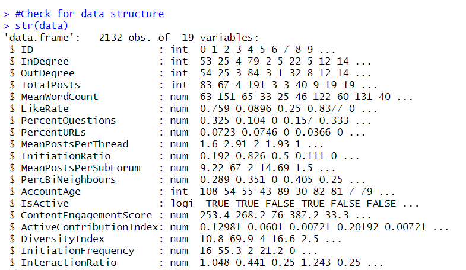
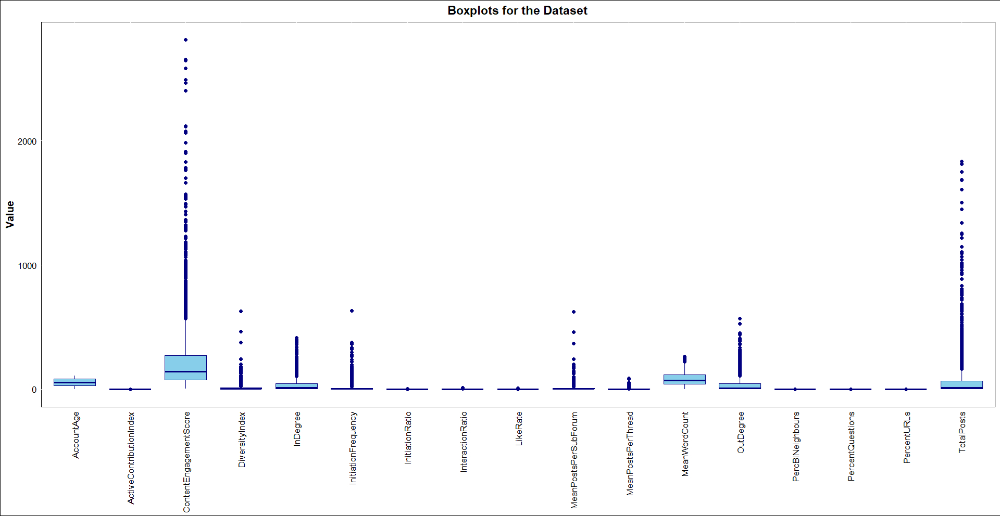

# Business Report: User Behavior Analysis for Social Media Company Z

## Overview

This repository contains a comprehensive business analysis report aimed at understanding user behavior on the platform of Company Z, a rapidly expanding social media company. The primary objective is to leverage data-driven insights to develop strategies that enhance user engagement, retention, and overall platform growth.

The report outlines a structured analysis approach, consisting of data exploration, preprocessing, clustering analysis, and the development of a predictive model. The insights generated from these processes are intended to guide marketing strategies, content creation, and platform management by identifying distinct user segments based on their interaction patterns.

## Key Sections

### 1. **Introduction**
Company Z, a social media platform, has seen rapid growth in terms of user base but lacks an in-depth understanding of user behavior on the platform. By better understanding user engagement and preferences, Company Z aims to improve user retention and unlock new opportunities for growth.

This report aims to solve this challenge by:
- Analyzing user behavior through detailed data exploration.
- Conducting cluster analysis to identify distinct groups within the user base.
- Developing a predictive model to forecast user behaviors and inform strategic decisions.

### 2. **Data Exploration and Preprocessing**

#### 2.1 **Dataset Description**
The dataset contains data from 2,307 users, with 13 variables capturing user activity, including:
- **InDegree**: Number of users interacting with a given user.
- **OutDegree**: Number of users a given user interacts with.
- **TotalPosts**: Total number of posts made by a user.
- **LikeRate**: Average likes per post.
- **AccountAge**: Age of the account in days.

#### 2.2 **Outlier Detection and Treatment**
Outliers in variables like **TotalPosts** and **LikeRate** were identified and appropriately handled to ensure robust results during clustering analysis.

#### 2.3 **Relationship Visualizations**
Visualizations revealed trends such as a positive correlation between user connectivity and engagement. These relationships guided the clustering and modeling steps.

### 3. **Cluster Analysis**

#### 3.1 **K-Means Algorithm**
K-Means was used to segment users into seven clusters based on activity metrics. Optimal cluster numbers were determined using the **Elbow Method** and **Silhouette Plot**.

#### 3.2 **Cluster Characteristics**
The clusters represent user behavior profiles such as:
- **Highly Engaged Contributors**: Users with diverse and impactful contributions.
- **Selective Contributors**: Users focusing on niche areas.
- **Passive Users**: Minimal engagement and interaction.

#### 3.3 **Insights**
Each cluster provides actionable insights for targeted strategies, including influencer partnerships for engaged clusters and content strategies for passive users.

### 4. **Predictive Model**

#### 4.1 **k-Nearest Neighbors (k-NN) Algorithm**
A k-NN model was developed to classify users into clusters. This model helps predict behaviors of new users and enables proactive engagement.

#### 4.2 **Evaluation Metrics**
Model performance was evaluated with:
- **Accuracy**: Achieved over 97%, confirming high predictive power.
- **Kappa Statistic**: Validated the model's robustness beyond random classification.
- **Confusion Matrix**: Highlighted strengths and areas for improvement, such as low accuracy in specific clusters.

#### 4.3 **Business Applications**
The model facilitates:
- **Segmentation of New Users**: Assigning them to clusters for tailored engagement.
- **Resource Allocation**: Efficiently directing resources based on predicted behaviors.
- **Strategy Optimization**: Enhancing marketing and content efforts for distinct user groups.

### 5. **Conclusion and Recommendations**

This analysis highlights distinct user behaviors, offering strategies to enhance user engagement and retention. The predictive model supports dynamic adaptation to user trends, ensuring Company Z remains competitive and user-focused.

