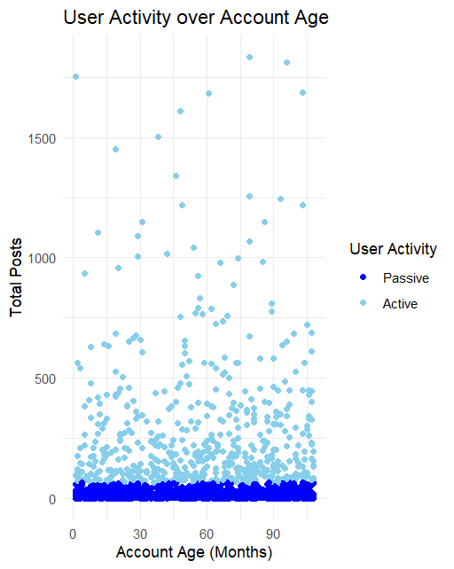
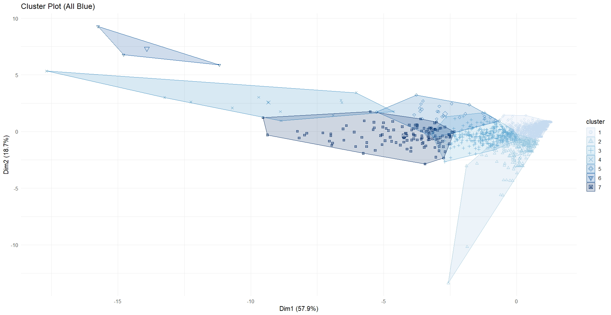

# Business Report: User Behavior Analysis for Social Media Company Z

## Overview

This repository contains a comprehensive business analysis report aimed at understanding user behavior on the platform of Company Z, a rapidly expanding social media company. The primary objective is to leverage data-driven insights to develop strategies that enhance user engagement, retention, and overall platform growth.

The report outlines a structured analysis approach, consisting of data exploration, preprocessing, clustering analysis, and the development of a predictive model. The insights generated from these processes are intended to guide marketing strategies, content creation, and platform management by identifying distinct user segments based on their interaction patterns.

## Key Sections

### 1. **Introduction**
Company Z, a social media platform, has seen rapid growth in terms of user base but lacks an in-depth understanding of user behavior on the platform. By better understanding user engagement and preferences, Company Z aims to improve user retention and unlock new opportunities for growth.

This report aims to solve this challenge by:
- Analyzing user behavior through detailed data exploration.
- Conducting cluster analysis to identify distinct groups within the user base.
- Developing a predictive model to forecast user behaviors and inform strategic decisions.

### 2. **Data Exploration and Preprocessing**

#### 2.1 **Dataset Description**
The dataset used for this analysis contains data from 2,307 users, with 13 variables each. These variables capture a broad spectrum of user activity, including:
- **InDegree**: The number of users interacting with a given user.
- **OutDegree**: The number of users a given user interacts with.
- **TotalPosts**: The total number of posts made by a user.
- **LikeRate**: The average number of likes a user's posts receive.
- **AccountAge**: The age of the account in days.

#### 2.2 **Outlier Detection and Treatment**
Several outliers were detected using boxplots, particularly in **TotalPosts**, **MeanWordCount**, and **LikeRate**. These outliers represent highly influential users and may skew the overall analysis if treated the same as typical users. As such, these values were handled appropriately to ensure the clustering model is not adversely impacted.

#### 2.3 **Histograms**
The distribution of variables like **TotalPosts** and **MeanWordCount** show right-skewed distributions, indicating that most users have few posts and shorter content. This suggests a small portion of users are highly active, while the majority are more passive. 

#### 2.4 **Correlation Matrix**
0The **Correlation Matrix** revealed important relationships:
- A strong positive correlation (0.989) between **InDegree** and **OutDegree**, indicating that users with higher interaction levels tend to post more frequently.
- A moderate correlation between **MeanPostsPerThread** and **TotalPosts**, suggesting that frequent posters also tend to contribute more posts within threads.

#### 2.5 **Relationship Visualizations**
Several relationship visualizations were created to explore patterns:
- **User Activity Over Account Age**: Most users have low engagement, though a few outliers show extremely high engagement. 
- **Total Posts vs Like Rate**: Users with fewer posts generally receive more likes per post, indicating that less frequent posts are more likely to be appreciated.

### 3. **Cluster Analysis**

#### 3.1 **Choice of K-Means Algorithm**
The K-means algorithm was selected for its ability to quickly identify distinct user groups based on numerical data. K-means is computationally efficient, scalable, and ideal for identifying patterns in large datasets.

#### 3.2 **Data Transformation and Normalization**
To ensure the accuracy of the clustering results, various preprocessing techniques were applied, including:
- **Outlier removal**: Outliers were identified and removed using the Interquartile Range (IQR) method.
- **Feature Engineering**: New indices like **ContentEngagementScore** and **ActiveContributionIndex** were created to combine multiple related features into single metrics that better capture user behavior.

#### 3.3 **Determining the Number of Clusters**
The **Elbow Method** and **Silhouette Plot** were used to determine the optimal number of clusters. The analysis suggested that seven clusters would provide the best fit for this dataset, balancing model complexity and data representativeness.

#### 3.4 **Model Execution**
With the optimal number of clusters determined, the K-means algorithm was run, and the results visualized. Each cluster represents a distinct user behavior profile, from highly engaged users to passive ones.

#### 3.5 **Characteristics of Each Cluster**
The following describes the characteristics of each of the seven identified clusters:

- **Cluster 1: Highly Engaged and Diverse Contributors**: These users are highly active and engage across multiple topics. They often initiate conversations and contribute meaningfully to the platform’s community.
- **Cluster 2: Moderately Engaged Users with Low Contribution Diversity**: These users contribute consistently but focus on fewer topics. They are moderately engaged but lack the diversity of Cluster 1.
- **Cluster 3 & 4: Less Active Users**: These clusters contain users who engage infrequently, with low diversity and participation in community discussions.
- **Cluster 5: Selectively Engaged Users**: Users in this cluster are highly engaged but focused on specific content areas, indicating niche interests.
- **Cluster 6: Very Active with High Initiation Frequency**: These users are highly energetic, starting many conversations, and are integral to content creation and community engagement.
- **Cluster 7: Diversely Engaged with Moderate Initiation**: These users are consistently engaged across multiple topics but do not dominate discussions.

#### 3.6 **Insights and Implications**
Each cluster provides valuable insights into user behavior that can inform targeted marketing and content strategies. For instance, users in **Cluster 1** and **Cluster 6** could be prime candidates for influencer partnerships or brand ambassador roles, while users in **Cluster 3** and **Cluster 4** may need content strategies aimed at increasing engagement.

### 4. **Supervised Learning Model**

#### 4.1 **Choice of Predictive Model**
The k-Nearest Neighbors (k-NN) model was chosen for its effectiveness in predicting categorical outcomes based on similarities between data points. This model is particularly well-suited for classifying users into predefined clusters.

#### 4.2 **Rationale for Model Selection**
The k-NN algorithm is non-parametric and adaptable, meaning it does not assume a fixed functional form and can learn directly from the data. This makes it ideal for our task of classifying users into clusters based on observed activity patterns.

#### 4.3 **Data Preparation**
Input features were scaled, and the data was split into training and test sets to ensure the model was validated and not overfitting. 

#### 4.4 **Model Training and Validation**
The model was trained using a **10-fold cross-validation** approach. Performance metrics such as accuracy and Kappa statistics confirmed that the k-NN model achieved over 97% accuracy in classifying users into clusters.

#### 4.5 **Evaluation Metrics**
The model's predictive performance was evaluated using:
- **Accuracy**: The overall performance of the model was above 97%.
- **Kappa Statistic**: A measure of the model's performance relative to random chance, showing robust predictive power.
- **Confusion Matrix**: Revealed that some clusters (e.g., Cluster 6) had low predictive accuracy, suggesting areas for model improvement.

#### 4.6 **Interpretation of Model Outcomes**
The k-NN model provides a powerful tool for:
- **Segmenting New Users**: Classifying new users into the appropriate cluster based on their activity patterns.
- **Targeting Marketing Efforts**: Tailoring marketing and content strategies to the specific needs of each user group.
- **Resource Allocation**: Allocating resources efficiently based on the predicted engagement levels of users in different clusters.

### 5. **Conclusion and Recommendations**

#### 5.1 **Summary of Insights**
This analysis has successfully segmented the user base into seven distinct clusters, each with unique engagement behaviors. The predictive model further enables the classification of new users, ensuring that marketing and engagement efforts are targeted effectively.

#### 5.2 **Strategic Recommendations**
Based on the cluster analysis, the following recommendations are made:
- **Influencer Partnerships**: Engage users from **Clusters 1**, **6**, and **7** for partnerships and brand ambassador programs.
- **Content Personalization**: Implement personalized content strategies for users in **Cluster 5**, who show a strong interest in specific topics.
- **Community Management**: For **Clusters 3** and **4**, develop strategies to increase user participation, such as targeted content and incentives for engagement.

These insights provide a roadmap for driving user engagement, improving retention, and maximizing the overall platform growth for Company Z.

